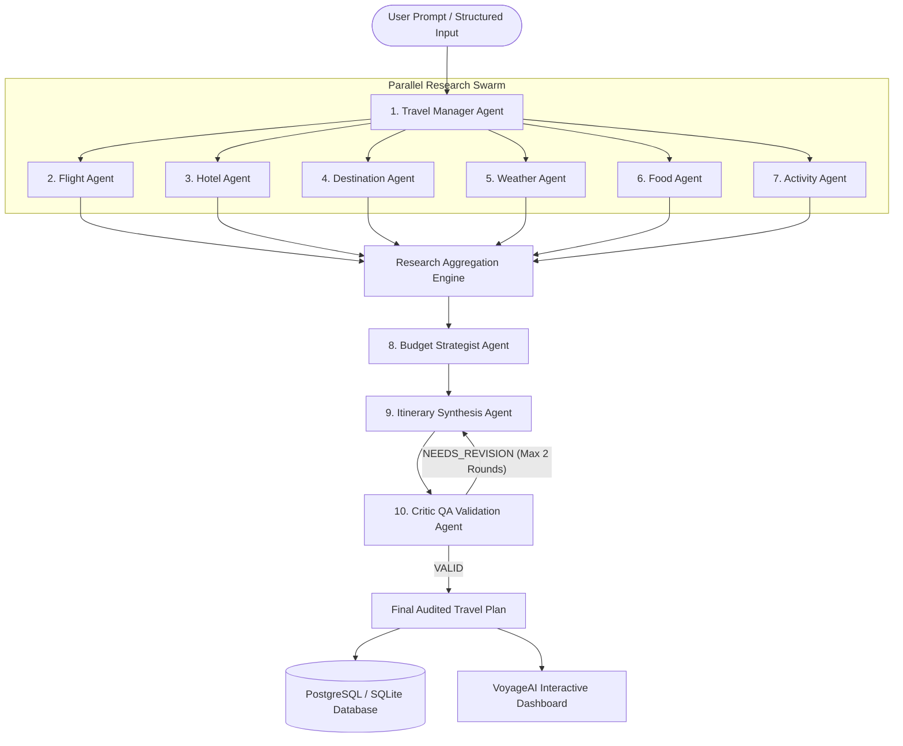

# VoyageAI ✈️

> **"Your intelligent team of AI travel agents."**

[](https://fastapi.tiangolo.com/)
[](https://react.dev/)
[](https://tailwindcss.com/)
[](https://groq.com/)
[](https://www.sqlalchemy.org/)
[](LICENSE)

An original, production-quality **Multi-Agent AI Travel Planning Web Application** engineered from scratch. VoyageAI transforms natural-language travel requests into audited, geographically clustered, day-by-day itineraries with granular budget calculations, multi-currency modeling, and trip memory follow-up conversations.

---

## 🌟 Key Features

- **True Multi-Agent Orchestration**: Decomposes travel requests across **10 specialized agents** instead of one monolithic prompt.
- **Concurrent Research Swarm**: Specialized research agents (Flight, Hotel, Destination, Weather, Food, and Activities) execute concurrently via asynchronous Python coroutines.
- **Natural Language & Structured Builders**: Plan by typing natural sentences (e.g., *"Plan a 7-day trip to Japan from Bangalore for two people in December with a ₹1,50,000 budget"*) or fine-tune exact criteria using the structured form builder.
- **Real-Time Live Progress Tracking**: Watch each agent transition through `Pending`, `Running`, `Completed`, or `Failed` states backed by real backend stages streamed via Server-Sent Events (SSE).
- **Adversarial Critic QA Validation**: A dedicated **Critic Agent** audits schedules for unrealistic transit, geographical backtracking, and duplicate sights, triggering automated revisions when flaws are found.
- **Multi-Currency Budgeting with 7% Emergency Reserve**: Categorizes expenses across Flights, Accommodations, Dining, Local Transit, Activities, and Contingency with instant currency switching (INR, USD, EUR, GBP, JPY).
- **Trip Memory AI Concierge**: Reopen trips anytime and ask contextual follow-up questions (*"Make Day 3 more relaxed"*, *"Add more vegetarian restaurants"*, *"Can I reduce this to ₹70,000?"*).
- **Multi-Format Export**: Export verified itineraries as formatted Markdown (`.md`), print-friendly HTML, or standalone PDF documents.
- **Resilient Fallback Layer**: Gracefully degrades to researched estimates when optional external APIs are absent. **Never crashes and never hallucinates fake flight numbers**.
- **Modern Glassmorphic UI**: High-contrast, responsive interface with persistent Dark and Light mode.

---

## 🏗️ System Architecture



---

## 🤖 The 10 Specialized Agents

| # | Agent Name | Primary Responsibility | External API Integration |
|---|---|---|---|
| **1** | **Travel Manager** | Parses criteria, resolves multi-city transit, extracts constraints | Groq LLM / Heuristic Engine |
| **2** | **Flight Agent** | Researches routes, IATA hubs, roundtrip fare corridors, airlines | AviationStack API |
| **3** | **Hotel Agent** | Curates neighborhood stays, nightly benchmarks, and amenities | Hospitality Index |
| **4** | **Destination Agent** | Catalogs UNESCO monuments, hidden gems, and local transit logistics | Tavily AI Web Search |
| **5** | **Weather Agent** | Analyzes climate conditions, temperature ranges, and packing advice | OpenWeather API |
| **6** | **Food Agent** | Curates authentic cuisine, food alleys, and certified dietary spots | Regional Gastronomy Atlas |
| **7** | **Activity Agent** | Ranks experiential activities by relevance to traveler passions | Experience Repositories |
| **8** | **Budget Agent** | Calculates 7 category allocations, per-person costs, and 7% reserve | Multi-Currency Engine |
| **9** | **Itinerary Agent** | Assembles geographically clustered Morning, Afternoon & Evening blocks | Schedule Synthesis |
| **10** | **Critic QA Agent** | Audits schedules for pacing, duplicate sights, and meal buffers | Feasibility QA Checker |

---

## 🛠️ Technology Stack

### Frontend
- **Framework**: React 19 + TypeScript (Vite 6)
- **Styling**: Tailwind CSS 3.4 (with custom Voyage palette, glassmorphism, and responsive grids)
- **Icons**: Lucide React
- **Animations & Effects**: Canvas Confetti

### Backend
- **Framework**: FastAPI (Python 3.11)
- **Asynchronous Concurrency**: `asyncio.gather` for parallel agent execution
- **Database ORM**: SQLAlchemy 2.0 (Relational persistence)
- **Validation**: Pydantic V2 (`ConfigDict`, strict schemas)
- **Authentication**: JWT (JSON Web Tokens) with `bcrypt` password hashing
- **Document Export**: ReportLab (PDF generation) and Markdown serializers

### AI & External Integrations
- **LLM Engine**: Groq API (`llama-3.3-70b-versatile`)
- **Aviation Schedules**: AviationStack API
- **Meteorology**: OpenWeather API
- **Web Research**: Tavily AI Search

---

## 📁 Project Structure

```
travelplanner/
├── backend/
│   ├── app/
│   │   ├── api/             # REST endpoints (auth, trips, chat, export)
│   │   ├── agents/          # 10 specialized agent implementations & orchestrator
│   │   ├── services/        # Abstraction layer for LLM, Aviation, Weather, WebSearch
│   │   ├── models/          # SQLAlchemy relational entities (Trip, Itinerary, Budget, etc.)
│   │   ├── schemas/         # Pydantic v2 data models
│   │   ├── database/        # Engine & session management (Postgres / SQLite)
│   │   ├── core/            # Configuration & security utilities
│   │   └── main.py          # FastAPI application entry point
│   ├── tests/               # Pytest test suite
│   └── requirements.txt
├── frontend/
│   ├── src/
│   │   ├── components/      # UI components (Navbar, AgentCard, Timeline, Budget, Chat)
│   │   ├── pages/           # Landing, Login, Register, Dashboard, Planner, Detail
│   │   ├── hooks/           # useAuth, useTheme
│   │   ├── services/        # API client
│   │   └── types/           # TypeScript domain definitions
│   └── package.json
├── docs/
│   ├── architecture.md      # Deep system architecture & concurrency model
│   ├── agents.md            # Detailed agent inputs, outputs, and behaviors
│   ├── api.md               # REST API specification
│   └── setup.md             # Development & production setup guide
├── .env.example
├── .gitignore
└── README.md
```

---

## 🚀 Quickstart & Installation

### 1. Clone & Configure Environment

```bash
git clone <repo-url>
cd travelplanner
cp .env.example .env
```

Edit `.env` to include your API keys (or leave them empty to run in **resilient fallback mode**):

```ini
GROQ_API_KEY=your_groq_api_key_here
GROQ_MODEL=llama-3.3-70b-versatile
TAVILY_API_KEY=your_tavily_key_here
AVIATIONSTACK_API_KEY=your_aviationstack_key_here
OPENWEATHER_API_KEY=your_openweather_key_here
DATABASE_URL=sqlite:///./voyageai.db
SECRET_KEY=voyageai_super_secret_jwt_key_32_characters_long
```

---

### 2. Run the Backend

```powershell
# Create and activate virtual environment
python -m venv venv
.\venv\Scripts\Activate.ps1

# Install requirements
pip install -r backend/requirements.txt

# Run the FastAPI server
$env:PYTHONPATH = "backend"
.\venv\Scripts\uvicorn app.main:app --host 0.0.0.0 --port 8000 --reload
```

Backend will be running at `http://localhost:8000`  
Interactive Swagger docs: `http://localhost:8000/docs`

---

### 3. Run the Frontend

In a separate terminal:

```bash
cd frontend
npm install
npm run dev
```

Frontend will be running at `http://localhost:5173`.

---

## 🧪 Testing

VoyageAI tests cover password hashing, user registration/login, travel manager criteria extraction, budget calculations, critic schedule audits, end-to-end orchestration, and RAG retrieval/context behavior:

```powershell
$env:PYTHONPATH = "backend"
.\venv\Scripts\pytest backend/tests -v
```

### RAG setup

Start the complete PostgreSQL + pgvector + backend + frontend stack with Docker Compose:

```powershell
Copy-Item .env.example .env
# Set a unique POSTGRES_PASSWORD and a random SECRET_KEY (at least 32 characters).
# Then configure real API keys and any provider settings in .env.
docker compose up --build
```

Open `http://localhost:8080`. PostgreSQL runs using the pgvector image and the API initializes the RAG schema at startup. Do not commit `.env`; keep `POSTGRES_PASSWORD` URL-safe (letters/numbers) for the Compose database URL.

### Create the separate administrator account

Admin credentials are **not** `.env` settings. Create the admin account after the backend is running; the password is prompted securely, hashed, and never printed:

```powershell
# Docker Compose
docker compose exec backend python -m app.create_admin

# Or, for a backend running locally from the repository root
$env:PYTHONPATH = "backend"
.\venv\Scripts\python.exe -m app.create_admin
```

The command requires a unique email and username and a password of at least 12 characters. Public registration cannot grant administrator privileges. Use the separate `/admin/login` page; it opens the protected `/admin` dashboard. The dashboard shows users, trips, agent runs and research-source totals, and provides RAG document management when pgvector is available.

For a local backend run outside Docker, RAG storage requires PostgreSQL with the **pgvector server extension** installed; SQLite remains available for the rest of local development but does not persist or search vectors. Point `DATABASE_URL` at PostgreSQL and make sure the database role can enable the extension (or have an administrator enable it):

```sql
CREATE EXTENSION IF NOT EXISTS vector;
```

Configure an OpenAI-compatible embeddings endpoint using `EMBEDDING_API_KEY`, `EMBEDDING_API_BASE_URL`, `EMBEDDING_MODEL`, and `EMBEDDING_DIMENSIONS`. Ingestion and semantic retrieval fail explicitly if embeddings or pgvector are unavailable; VoyageAI does not create synthetic embeddings. Only accounts created through the administrator bootstrap command may manage knowledge documents.

Authenticated RAG search is available at `POST /api/rag/search`. Administrators can list, ingest, and delete knowledge documents at `/api/rag/admin/documents` using multipart upload fields for title/source and optional URL, destination, country, category, document type, publication date, and update date. Supported files are PDF, TXT, Markdown, and HTML (PDFs must contain extractable text; OCR is not performed). Duplicate content and URLs are skipped. Answers expose `RAG KNOWLEDGE` or `WEB RESEARCH` source labels and citations; a failed retrieval with no web results produces an explicit abstention. Rapidly changing flight, hotel, weather, and alert data must continue to use live providers rather than the knowledge base.

### GeoNames place lookup and RAG references

The GeoNames source file is structured gazetteer data, so VoyageAI keeps it in a relational lookup table instead of embedding the full file. The import script streams `data/Geonames/allCountries.txt`, filters to populated places with recorded population in its configured Asian-country scope, and imports in batches. Run it after PostgreSQL is available:

```powershell
$env:PYTHONPATH = "backend"
.\venv\Scripts\python.exe backend/scripts/import_asia_geonames.py
```

The lookup endpoint is `GET /api/places/search?q=tokyo&country_code=JP&limit=10`. It returns matching place names, coordinates, population, administrative code, and time zone. Searching is prefix-based; country code and limit are optional. The table is created by the importer, so the endpoint returns `503` until the import has completed.

To make a concise, attributed list of populated places available to semantic RAG search, export one Markdown reference (up to 250 places) and upload it in the administrator dashboard's RAG knowledge section:

```powershell
.\venv\Scripts\python.exe backend/scripts/export_geonames_rag.py --country JP --limit 100 --output data\rag_exports\geonames-jp.md
```

The export is a gazetteer, not a travel guide or source of current travel advice. GeoNames data is licensed under CC BY 4.0; the generated Markdown retains attribution. RAG ingestion still requires PostgreSQL with pgvector and a configured embedding provider. Rotate API keys and passwords that have been exposed, and do not commit `.env`.

---

## 💡 Interview & Final-Year CS Project Talking Points

When demonstrating or explaining this project in a technical interview:
1. **Decomposed Multi-Agent Paradigm**: Explain why single-prompt LLM travel planners fail (context window bloat, hallucinations, geographic backtracking). VoyageAI delegates discrete responsibilities to distinct agents.
2. **True Concurrency via Coroutines**: Discuss how 6 independent research agents run simultaneously using `asyncio.gather`, slashing latency compared to sequential chains.
3. **Adversarial Critic Loop**: Explain how the Critic Agent audits schedule feasibility and triggers automated revision loops with iteration limits.
4. **Resilient Service Abstraction**: Emphasize how external services (AviationStack, OpenWeather, Tavily) are wrapped in fallback layers that clearly distinguish live data from researched estimates without crashing.
5. **Full Trip Memory**: Detail how follow-up queries maintain existing trip context in a relational conversation schema.

---

## 📄 License

This project is open-source under the MIT License. Built for modern AI-assisted engineering.
