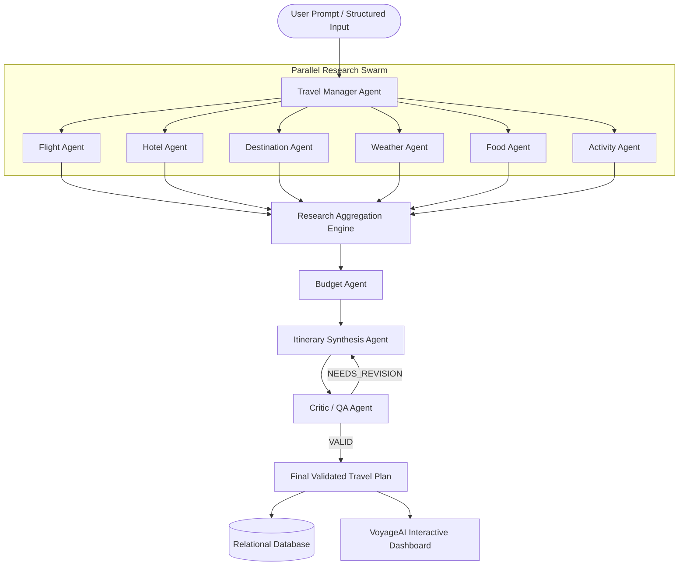
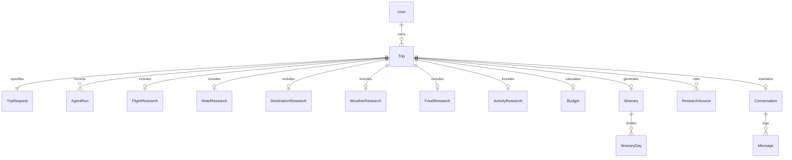

# VoyageAI System Architecture

## 1. Overview & Core Philosophy

**VoyageAI** is a production-grade multi-agent AI travel planning platform designed to transform freeform natural-language trip intentions into audited, geographically clustered, day-by-day travel itineraries with granular budget calculations.

Rather than relying on a single monolithic LLM prompt that suffers from hallucination, timeline drift, and impossible geographic schedules, VoyageAI decomposes travel planning into **specialized, autonomous agent roles coordinated by a central manager**.

---

## 2. Agent Orchestration Pipeline

The orchestration cycle proceeds across five distinct stages:

### Stage 1: Intent Extraction & Routing
- Handled by the **Travel Manager Agent**.
- Evaluates raw natural language (`raw_prompt`) or structured form parameters.
- Extracts:
  - Origin & Destination (including multi-city detection, e.g., "Paris, Rome and Florence")
  - Duration (in days and nights)
  - Traveler count
  - Target budget & preferred currency
  - Style, explicit interests, dietary restrictions, and smart constraints.

### Stage 2: Concurrent Research Swarm
- 6 independent research agents execute simultaneously using `asyncio.gather(*tasks, return_exceptions=True)`:
  - **Flight Agent**: Interrogates AviationStack API or analyzes flight routes, fare ranges, airlines, and durations.
  - **Hotel Agent**: Evaluates central vs boutique accommodations matching budget constraints.
  - **Destination Agent**: Queries Tavily web search (preserving source citations) to identify major monuments, hidden gems, and districts.
  - **Weather Agent**: Consults OpenWeather or seasonal climate models to estimate temperatures, precipitation probability, and packing needs.
  - **Food Agent**: Researches local culinary specialties, food markets, and certified dietary spots (vegetarian, vegan, halal).
  - **Activity Agent**: Curates and ranks experiential activities matched to user passions.

### Stage 3: Financial Optimization & Budgeting
- The **Budget Agent** synthesizes estimates across Flights, Accommodation, Food, Transit, Activities, and Sundries.
- Automatically calculates a **7% emergency contingency buffer**.
- Computes per-person costs and warns if the projected total exceeds or fits comfortably within the traveler's stated budget.

### Stage 4: Itinerary Synthesis
- The **Itinerary Agent** receives all aggregated research data and organizes each day into:
  - **Morning Block** (09:00 - 12:30)
  - **Afternoon Block** (13:30 - 17:30)
  - **Evening Block** (18:30 - 21:30)
- Enforces **geographical clustering** so stops on the same day are in the same district, preventing zig-zagging or excessive commute times.

### Stage 5: Critic QA & Validation Loop
- The **Critic Agent** audits the proposed schedule for:
  - Geographic backtracking
  - Impossible transit durations
  - Duplicate attraction visits
  - Missing meal and rest buffers
  - Weather misalignment
- If issues are detected, it marks the status as `NEEDS_REVISION` and feeds actionable guidance back to the Itinerary Agent.
- Guardrails enforce a maximum of 2 revision iterations to guarantee timely completion without infinite loops.

---

## 3. Database Entity Relationship Diagram

---

## 4. API Resilience & Fallback Strategy

VoyageAI never crashes when an optional external integration is unavailable:
1. **Groq LLM**: If unconfigured or rate-limited, intelligent deterministic heuristic parsers synthesize structured requirements.
2. **AviationStack**: If missing or failing, realistic commercial route corridors and fare benchmarks are returned with `is_live_data = False`.
3. **OpenWeather**: If unavailable or future dates exceed 7-day forecast windows, historical seasonal climate averages are provided.
4. **Tavily Web Search**: If missing, curated regional knowledge bases provide verified attraction and culinary data.
